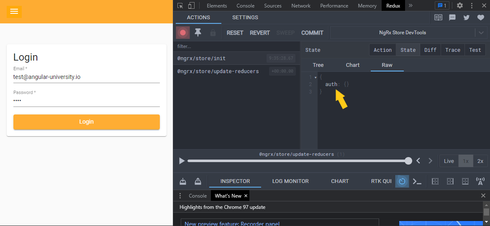
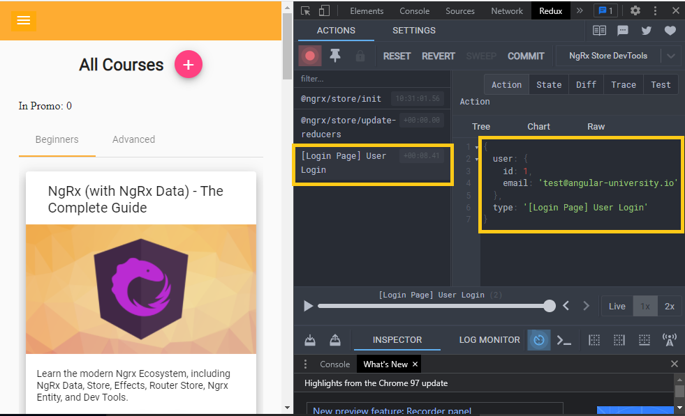
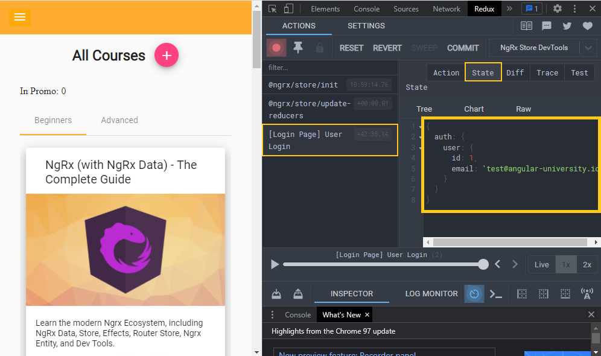

## Ngrx (with NgRx Data) - The Complete Guide

This repository contains the code of the video course [Ngrx (with NgRx Data) - The Complete Guide](https://angular-university.io/course/ngrx-course).

This course repository is updated to Angular v13:


# Installation pre-requisites

For taking the course we recommend installing Node 16 Long Term Support Edition (LTE).

To easily switch between node versions on your machine, we recommend using a node virtual environment tool such as [nave](https://www.npmjs.com/package/nave) or [nvm-windows](https://github.com/coreybutler/nvm-windows), depending on your operating system. 

For example, here is how you switch to a new node version using nave:

    # note that you don't even need to update your node version before installing nave
    npm install -g nave
    
    nave use 12.3.1
    node -v
    v12.3.1

# Installing the Angular CLI

With the following command the angular-cli will be installed globally in your machine:

    npm install -g @angular/cli 


# How To install this repository

We can install the master branch using the following commands:

    git clone https://github.com/angular-university/angular-ngrx-course.git
    
This repository is made of several separate npm modules, that are installable separately. For example, to run the au-input module, we can do the following:
    
    cd ngrx-course
    npm install

Its also possible to install the modules as usual using npm:

    npm install 

This should take a couple of minutes. If there are issues, please post the complete error message in the Questions section of the course.

# To Run the Development Backend Server

We can start the sample application backend with the following command:

    npm run server

This is a small Node REST API server.

# To run the Development UI Server

To run the frontend part of our code, we will use the Angular CLI:

    npm start 

The application is visible at port 4200: [http://localhost:4200](http://localhost:4200)


# Important 

This repository has multiple branches, have a look at the beginning of each section to see the name of the branch.

At certain points along the course, you will be asked to checkout other remote branches other than master. You can view all branches that you have available remotely using the following command:

    git branch -a

  The remote branches have their starting in origin, such as for example 1-start.

We can checkout the remote branch and start tracking it with a local branch that has the same name, by using the following command:

      git checkout -b 1-start 

It's also possible to download a ZIP file for a given branch,  using the branch dropdown on this page on the top left, and then selecting the Clone or Download / Download as ZIP button.

# Course Notes
## General Setup

1. open in IntelliJ
2. `npm install`
3. `git checkout 1-start`
4. run backend server in a console: `npm run server`
5. run frontend server in another console: `npm start`

## What is state management

**without state management:**
- each time the navigation changes data is loaded even though we might have visited the same page already previously
- changes in multipe components are usually triggered by 'fresh' backend requests
- Observables for backend requests are tied to components (at least via services)
- livecycle of the data is typically tied to the lifecycle of components

**requirments for state management:**
- we want to get rid of redundant http requests
- save actions in background (without making the user wait)
- no specific logic for handling data modifications in views 
- minimal loading indicators 

## Installing NgRx and the NgRx DevTools
1. `ng add @ngrx/store` (on $id error try:`ng add @ngrx/store@latest --minimal false`)
app.module.ts will be changed:
```ts
...
StoreModule.forRoot(reducers, {
      metaReducers
    })
...
```
2. `ng add @ngrx/store-devtools` (on $id error try:`ng add @ngrx/store-devtools@latest`)
app.module.ts will be changed:
```ts
StoreDevtoolsModule.instrument({ maxAge: 25, logOnly: environment.production })
```
## NgRx key concepts - actions and reducers
### Configuring the NgRx Feature module using the NgRx schematics
- The auth module is eagerly setup. 
- The courses module is lazy loaded.

For the auth module the store is setup by:
`ng generate store auth/Auth --module auth.module.ts`

This mainly affects the auth.module.ts file by adding the StoreModule declaration. Finally we remove the `{ metaReducers: fromAuth.metaReducers }` definition because it is not used in that module. Secondly the index.ts file is generated. 
When we run the application a new store is added and can be seen in the redux dev tools:



### Actions and action creators 
An **action** is a plane JS object that we send to store to trigger some modifications of the store. An action contains typically a type and a payload. 
```ts
this.store.dispatch({
          type: 'Login Action',
          payload: {
            userProfile: user
          }
        });
```
With an **action creator** actions can be declared.

```ts
import {props} from '@ngrx/store';
import {User} from './user.model';

export const login = createAction('[Login Page] User Login', props<{ user: User }>())
```
The **action type** definition is the only mandatory argument and follows a convention where in the square brackets the source of the action is described. The other part describes the action itself. 
The method defined that way can be used later to create login actions 
```ts
const newLoginAction = login({user: {...}}); 
```

___
!!! Important: an action never modifies the store state directly. 
___
A simple way to group actions is to create a file action-types and using this pattern:
```ts
import * as AuthActions from './auth.actions';

export {AuthActions};
```
they are grouped and can be accessed together.

### NgRx Reducers 
A **reducer** is a plane JS function that modifies the state.
```ts
function authReducer(state, action): State {
    ...
}
```
There is also a createReducer function:
```ts
export const authReducer = createReducer(initAuthState,
  on(AuthActions.login, (state, action) => {
    return {
      ...state,
      user: action.user
    };
  })
);
```


## NgRx key concepts - Selectors and Effects
### Query store data
Pipe into an observable:
```ts
      this.isLoggedIn$ = this.store.pipe(
        map(state => !!state['auth'].user)
      );
```
### Selectors
It is possible to reduce the number of changes to those of real value changes. One way would be to use the `distinctUntilChanged()` operator. But NgRx has something built in because its usage is so common in state queries. It is the `select` operator. 
```ts
      this.isLoggedIn$ = this.store.pipe(
        select(state => !!state['auth'].user)
      );
```


