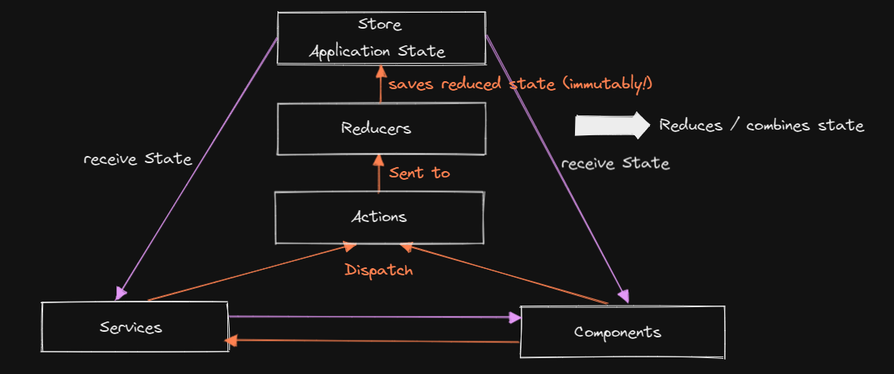
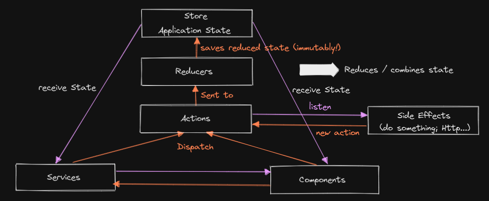
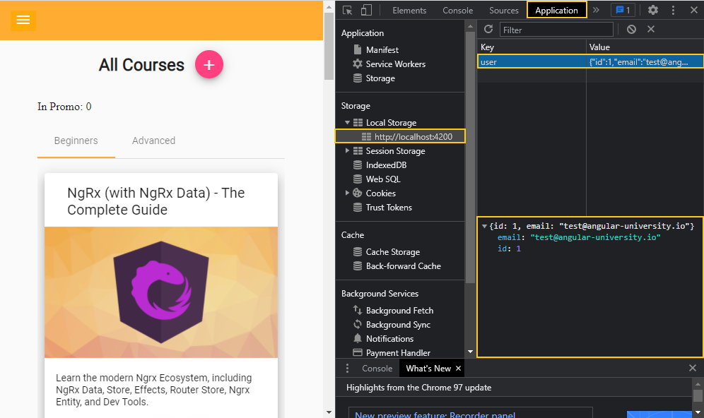
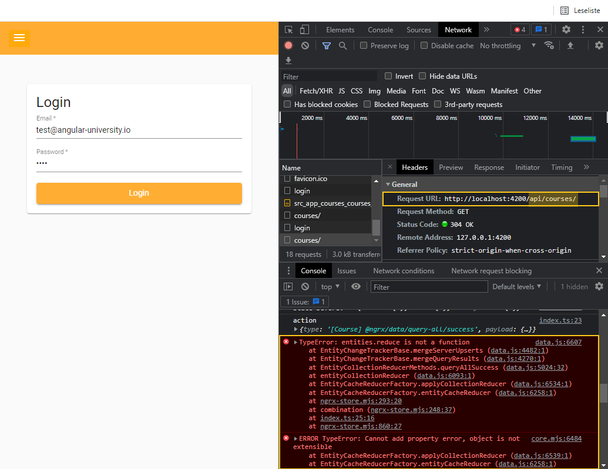

## Ngrx (with NgRx Data) - The Complete Guide

This repository contains the code of the video course [Ngrx (with NgRx Data) - The Complete Guide](https://angular-university.io/course/ngrx-course).

This course repository is updated to Angular v13:


# Installation pre-requisites

For taking the course we recommend installing Node 16 Long Term Support Edition (LTE).

To easily switch between node versions on your machine, we recommend using a node virtual environment tool such as [nave](https://www.npmjs.com/package/nave) or [nvm-windows](https://github.com/coreybutler/nvm-windows), depending on your operating system. 

For example, here is how you switch to a new node version using nave:

    # note that you don't even need to update your node version before installing nave
    npm install -g nave
    
    nave use 12.3.1
    node -v
    v12.3.1

# Installing the Angular CLI

With the following command the angular-cli will be installed globally in your machine:

    npm install -g @angular/cli 


# How To install this repository

We can install the master branch using the following commands:

    git clone https://github.com/angular-university/angular-ngrx-course.git
    
This repository is made of several separate npm modules, that are installable separately. For example, to run the au-input module, we can do the following:
    
    cd ngrx-course
    npm install

Its also possible to install the modules as usual using npm:

    npm install 

This should take a couple of minutes. If there are issues, please post the complete error message in the Questions section of the course.

# To Run the Development Backend Server

We can start the sample application backend with the following command:

    npm run server

This is a small Node REST API server.

# To run the Development UI Server

To run the frontend part of our code, we will use the Angular CLI:

    npm start 

The application is visible at port 4200: [http://localhost:4200](http://localhost:4200)


# Important 

This repository has multiple branches, have a look at the beginning of each section to see the name of the branch.

At certain points along the course, you will be asked to checkout other remote branches other than master. You can view all branches that you have available remotely using the following command:

    git branch -a

  The remote branches have their starting in origin, such as for example 1-start.

We can checkout the remote branch and start tracking it with a local branch that has the same name, by using the following command:

      git checkout -b 1-start 

It's also possible to download a ZIP file for a given branch,  using the branch dropdown on this page on the top left, and then selecting the Clone or Download / Download as ZIP button.

# Course Notes
## General Setup

1. open in IntelliJ
2. `npm install`
3. `git checkout 1-start`
4. run backend server in a console: `npm run server`
5. run frontend server in another console: `npm start`

## What is state management

**without state management:**
- each time the navigation changes data is loaded even though we might have visited the same page already previously
- changes in multipe components are usually triggered by 'fresh' backend requests
- Observables for backend requests are tied to components (at least via services)
- livecycle of the data is typically tied to the lifecycle of components

**requirments for state management:**
- we want to get rid of redundant http requests
- save actions in background (without making the user wait)
- no specific logic for handling data modifications in views 
- minimal loading indicators 

### Redux State Management

### NgRx State Management

Differences to 'normal' Redux:

- deeply integrated into Angular
- uses RxJS
- uses TypeScript
- provides a defined way for implementing side effects such as loading data 

## Installing NgRx and the NgRx DevTools
1. `ng add @ngrx/store` (on $id error try:`ng add @ngrx/store@latest --minimal false`)
app.module.ts will be changed:
```ts
...
StoreModule.forRoot(reducers, {
      metaReducers
    })
...
```
2. `ng add @ngrx/store-devtools` (on $id error try:`ng add @ngrx/store-devtools@latest`)
app.module.ts will be changed:
```ts
StoreDevtoolsModule.instrument({ maxAge: 25, logOnly: environment.production })
```
## NgRx key concepts - actions and reducers
### Configuring the NgRx Feature module using the NgRx schematics
- The auth module is eagerly setup. 
- The courses module is lazy loaded.

For the auth module the store is setup by:
`ng generate store auth/Auth --module auth.module.ts`

This mainly affects the auth.module.ts file by adding the StoreModule declaration. Finally we remove the `{ metaReducers: fromAuth.metaReducers }` definition because it is not used in that module. Secondly the index.ts file is generated. 
When we run the application a new store is added and can be seen in the redux dev tools:


### Actions and action creators 
An **action** is a plane JS object that we send to store to trigger some modifications of the store. An action contains typically a type and a payload. 
```ts
this.store.dispatch({
          type: 'Login Action',
          payload: {
            userProfile: user
          }
        });
```
With an **action creator** actions can be declared.

```ts
import {props} from '@ngrx/store';
import {User} from './user.model';

export const login = createAction('[Login Page] User Login', props<{ user: User }>())
```
The **action type** definition is the only mandatory argument and follows a convention where in the square brackets the source of the action is described. The other part describes the action itself. 
The method defined that way can be used later to create login actions 
```ts
const newLoginAction = login({user: {...}}); 
```

___
!!! Important: an action never modifies the store state directly. 
___
A simple way to group actions is to create a file action-types and using this pattern:
```ts
import * as AuthActions from './auth.actions';

export {AuthActions};
```
they are grouped and can be accessed together.

### NgRx Reducers 
A **reducer** is a plane JS function that modifies the state.
```ts
function authReducer(state, action): State {
    ...
}
```
There is also a createReducer function:
```ts
export const authReducer = createReducer(initAuthState,
  on(AuthActions.login, (state, action) => {
    return {
      ...state,
      user: action.user
    };
  })
);
```


## NgRx key concepts - Selectors and Effects
### Query store data
Pipe into an observable:
```ts
this.isLoggedIn$ = this.store.pipe(
  map(state => !!state['auth'].user)
);
```
### Selectors
It is possible to reduce the number of changes to those of real value changes. One way would be to use the `distinctUntilChanged()` operator. But NgRx has something built in because its usage is so common in state queries. It is the `select` operator. 
```ts
this.isLoggedIn$ = this.store.pipe(
  select(state => !!state['auth'].user)
);
```
We can take it a step further and avoid even the calculation of `!!state['auth'].user` every time the store has been updated by using a **Selector**. It keeps memory of previous calculation in a cache - essentially it is a mapping function with memory.
In a ...selectors.ts file of the store module we can define Selector creators:
```ts
export const isLoggedIn: Selector<AuthState, boolean> = createSelector(state => state['auth'], auth => !!auth.user);
```
used then like:
```ts
this.isLoggedIn$ = this.store.pipe(
    select(isLoggedIn)
);
```
Because its simply a mapping function we can even define selectors like this:
```ts
export const isLoggedOut: Selector<AuthState, boolean> = createSelector(isLoggedIn, loggedIn => !loggedIn);
```
Where `isLoggedIn` was just the other selector creator. 
### NgRx feature selectors
The pure selectors we used earlier provide no implicit type information for the projector argument.
To define typesafe selectors we can use **feature selectors**. 
```ts
export const selectAuthState = createFeatureSelector<AuthState>('auth');
```
here:
```ts
export const isLoggedIn: Selector<AuthState, boolean> = createSelector(selectAuthState, auth => !!auth.user);
```
### NgRx Effects - what are side effects
At first import the effects module into the root module. In the imports section add:
```ts
EffectsModule.forRoot([AuthEffects])
```
where `AuthEffects` is defined like:
```ts
@Injectable()
export class AuthEffects {
  constructor(private actions$: Actions) {
    actions$.subscribe(action => {
      if (action.type === '[Login Page] User Login') {
        localStorage.setItem('user', JSON.stringify(action['user']));
      }
    });
  }
}
```
With a valid login we can see the user auth saved in the local storage.

optimizations:
```ts
@Injectable()
export class AuthEffects {
  constructor(private actions$: Actions) {
    const login$ = this.actions$.pipe(
      ofType(AuthActions.login),
      tap(action => {
        localStorage.setItem('user', JSON.stringify(action.user));
      })
    );
    login$.subscribe();
  }
}
```
`ofType(...)` operator - is essentially a NgRx filter (like filter op in RxJs).  
When the `createEffect()` function is used, we can go even further. The function will manage the subscription and error handling for the observable. 
```ts
@Injectable()
export class AuthEffects {
  login$ = createEffect(() =>
    this.actions$.pipe(
      ofType(AuthActions.login),
      tap(action => localStorage.setItem('user', JSON.stringify(action.user)))
    ),
    { dispatch: false }
  );

  constructor(private actions$: Actions) {}
}
```
Side effects have usually further actions to dispatch but here this isn't needed. But we need to tell then, that there is no need to dispatch with the config param `dispatch`.
___
When creating side effects, it is recommended to stop the angular CLI server to prevent infinite loops and crashes.
___ 
## NgRx Development Tools
### Setup time travaling for the router
To have full time machine functionality we need also the router to work with our NgRx state. This is simple by adding the module to the root module imports:
```ts
StoreRouterConnectingModule.forRoot({stateKey: 'router', routerState: RouterState.Minimal})
```
*stateKey* - is the key the router stores its state to  
*routerState* - RouterState.Minimal is the minimal configuration for the data held in the state which is a serializable version of the router state containing:
  - the url 
  - parameters for triggering the state   

Secondly the reducers map needs to be modified:
```ts
export const reducers: ActionReducerMap<AppState> = {
  router: routerReducer
};
```
### Runtime Checks
To be sure te state is not modified directly and all actions and stte changes can be monitored with the dev tools add: 
```ts
...
runtimeChecks: {
  strictStateImmutability: true,
  strictActionImmutability: true,
  strictActionSerializability: true,
  strictStateSerializability: true
}
...
```
to the root module configuration of the store module.

### Metareducer
Like common reducers but in difference metaReducers are called before the reducers are called.
When to use metaReducers:
- strictStateImmutability was implemented at first by using metaReducers
- cross cutting requirements like logging

```ts
export function logger(reducer: ActionReducer<any>): ActionReducer<any> {
  return (state, action) => {
    console.log('state before: ', state);
    console.log('action: ', action);

    return reducer(state, action);
  };
}
```
## NgRx entities 
There is a special pattern known as the entity format. As example for the CoursesState:
```ts
export interface CoursesState {
  entities: { [key: number]: Course };
  ids: number[];
}
```
Here `entities` stores the data in a id query optimized way. Secondly ids reflects the natural order of the items.
With the EntityModule that can be implemented more easy:
```ts
export interface CoursesState extends EntityState<Course> {
}
```
### NgRx Entity Adapter 
The access of NgRx entities can become cumbersome. NgRx provides an utility known as **adapter**.
In course.reducers.ts file:
```ts
export const adapter = createEntityAdapter<Course>();
```
The adapter makes it easy to modify a list in the reducer. 
```ts
export const coursesReducer = createReducer(
  initialCoursesState,
  on(CourseActions.allCoursesLoaded, (state, action) => adapter.addAll(action.courses, state))
);
```
### NgRx Entity Selectors
We can use our adapter here in courses.selectors.ts:
```ts
export const selectAllCourses = createSelector(selectCoursesState, fromCourses.selectAll);
```
with addding:
```ts
export const {selectAll} = adapter.getSelectors();
```
in the course.reducer.ts file.
### Entity adapter configuration - understanding sortComparator and selectId 
The course should be sorted by their sequential number. With the `compareCourses` function we can already sort the courses by just inserting:
```ts
export const adapter = createEntityAdapter<Course>({
  sortComparer: compareCourses
});
```
The default key for the id field is `id` but however if you choose differently you can specify a custom id field by passing:
```ts
export const adapter = createEntityAdapter<Course>({
  sortComparer: compareCourses,
  selectId: course => course.courseId
});
```
### Load data only when it's needed
To achieve this we need to change the resolver and add another state with adapter.
```ts
export interface CoursesState extends EntityState<Course> {
  allCoursesLoaded: boolean;
}
// ...
export const initialCoursesState = adapter.getInitialState({
  allCoursesLoaded: false
});

export const coursesReducer = createReducer(
  initialCoursesState,
  on(
    CourseActions.allCoursesLoaded,
    (state, action) => adapter.addAll(action.courses, {...state, allCoursesLoaded: true}))
);
```
The selector:
```ts
export const areCoursesLoaded = createSelector(
  selectAllCourses,
    courses => courses && courses.length > 0
);
```
and finally the resolver:
```ts
resolve(route: ActivatedRouteSnapshot, state: RouterStateSnapshot): Observable<any> {
  return this.store.pipe(
    select(areCoursesLoaded),
    tap(coursesLoaded => {
      if (!this.loading && !coursesLoaded) {
        this.loading = true;
        this.store.dispatch(loadAllCourses());
      }
    }),
    filter(coursesLoaded => coursesLoaded),
    first(),
    finalize(() => this.loading = false)
  );
}
```
Here we use the selector to first determine the loaded state. The final filter is important here so that the sream only gets fully evaluated when all courses have been loaded.

### Optimistically Editing Entity Data - The Edit Course Dialog
To update a course in the courses list, we create a new action:
```ts
export const courseUpdated = createAction(
  '[Edit Course Dialog] Course Updated',
  props<{update: Update<Course>}>()
);
```
The NgRx `Update` can be used with NgRx entities for partial updates. In the onSave function of the edit course dialog component:
```ts
onSave() {
  const course: Course = {
    ...this.course,
    ...this.form.value
  };

  const update: Update<Course> = {
    id: course.id,
    changes: course
  };

  this.store.dispatch(courseUpdated({update}));
  //...
}
```
It's important to use `concatMap` for the save side effect. 
```ts
updateCourse$ = createEffect(
  () => this.action$.pipe(
    ofType(CourseActions.courseUpdated),
    concatMap(action => this.coursesHttpService.saveCourse(action.update.id, action.update.changes))
  ),
  {dispatch: false}
);
```
## NgRx Data
NgRx Data helps in handling entity data and avoid to much boiler plate. The following examples are committed in the branch *1-auth-finished*.
### Add NgRx Data to the module
In app.modules.ts imports add:
```ts
//...
EntityDataModule.forRoot({}),
//...
```
The `{}` means there are no concrete entities at this level. 
In the courses module we add the specific configuration:
```ts
//...
const entityMetadata: EntityMetadataMap = {
  Course: {}
};
//...
export class CoursesModule {

  constructor(private eds: EntityDefinitionService) {
    eds.registerMetadataMap(entityMetadata);
  }
}
```
In the curly brackets some options can be defined. We will use that later. For now we neeed to register the map via the injected `EntityDefinitionService`.
### The service to load and update course with NgRx Data
We create a new file course-entity.service.ts:
```ts
import {EntityCollectionServiceBase, EntityCollectionServiceElementsFactory} from '@ngrx/data';
import {Course} from '../model/course';
import {Injectable} from '@angular/core';

@Injectable()
export class CourseEntityService extends  EntityCollectionServiceBase<Course> {
  constructor(serviceElementsFactory: EntityCollectionServiceElementsFactory) {
    super('Course', serviceElementsFactory);
  }
}
```
The `CourseEntityService` must now be added to the Course module providers section:
```ts
//...
providers: [
  //...
  CourseEntityService
]
//...
```
### The Resolver 
We create a new file courses.resolver.ts in services: 
```ts
@Injectable()
export class CoursesResolver implements Resolve<boolean> {
  constructor(private coursesService: CourseEntityService) {}

  resolve(route: ActivatedRouteSnapshot, state: RouterStateSnapshot): Observable<boolean> {
    return this.coursesService.getAll().pipe(
      map(courses => !!courses)
    );
  }
}
```
and add it to the course module providers.
```ts
//...
providers: [
  //...
  CoursesResolver
]
//...
```
Finally we can use it now in the routes configuration. 
```ts
export const coursesRoutes: Routes = [
  {
    path: '',
    component: HomeComponent,
    resolve: {
      courses: CoursesResolver
    }
  },
  {
    path: ':courseUrl',
    component: CourseComponent,
    resolve: {
      courses: CoursesResolver
    }
  }
];
```
NgRx data works by convention. For now we errors though:

but we will see how to handle it. 
### Custom Data services
To define a custom NgRx data service we can create our own service definition:
```ts
@Injectable()
export class CoursesDataService extends DefaultDataService<Course> {
  constructor(http: HttpClient, httpUrlGenerator: HttpUrlGenerator) {
    super('Course', http, httpUrlGenerator);
  }
}
```
For now it uses still the standard configuration.
... and add it to the courses module providers...
```ts
//...
providers: [
  //...  
  CoursesDataService
]
//...
```
... and register the service in the courses module constructor.
```ts
constructor(//...
            private entityDataService: EntityDataService,
            private coursesDataService: CoursesDataService) {
  //...  
  entityDataService.registerService('Course', coursesDataService);
}
```
With that in place NgRx Data knows there is a custom service definition. 
Now we can add some costumization.

```ts
//...
@Injectable()
export class CoursesDataService extends DefaultDataService<Course> {
  //...
  getAll(): Observable<Course[]> {
    return this.http.get('/api/courses').pipe(
      map(res => res['payload'])
    );
  }
}
```
### Controlling Data Loading with the NgRx Data loaded flag
To load the data only once the following changes must be done for the courses resolver:
```ts
  resolve(route: ActivatedRouteSnapshot, state: RouterStateSnapshot): Observable<boolean> {
    return this.coursesService.loaded$.pipe(
      tap((loaded: boolean) => {
        if (!loaded) {
          this.coursesService.getAll();
        }
      }),
      filter(loaded => !!loaded),
      first()
    );
  }
```
`loaded$` is an observable of the loaded state. The rest is common with our previous approach for loading just once with plain entities.

### Querying store data with the entities$ observable

```ts
constructor(
  // ...
  private courseEntityService: CourseEntityService) {
}

// ...

reload()
{
  this.beginnerCourses$ = this.courseEntityService.entities$
      .pipe(
          map(courses => courses.filter(course => course.category === 'BEGINNER'))
      );
  // ...
}
```
### sortComparer
In courses.module.ts:
```ts
const entityMetadata: EntityMetadataMap = {
  Course: {
    sortComparer: compareCourses
  }
};
```


